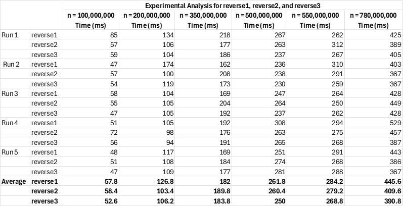
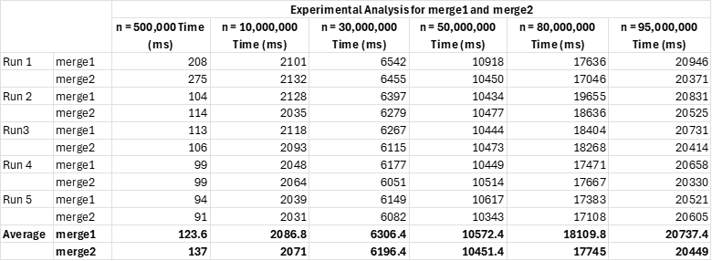

# Algorithms
A project for CIS-320: Data Structures demonstrating experimental, asymptotic, and algorithmic analysis

This project served as a homework for Data Structures my sophomore year of college, its main purpose being implementations of experimental design and analysis through setting up experiments related to runtime and asymptotic and algorithmic analysis through correctness arguments and runtime analyses in Big-O notation.

### Project Overview
The project includes:
- Three methods of reversing an input array, reverse1, reverse2, and reverse3
- Two methods of merging two sorted input arrays into a new, sorted array, merge1 and merge2

Each algorithm was compared based upon their runtimes.

### Experimental Design
The experimental design of this project involved :
- Choosing values of n, where n is the size of an input array, on which to run each algorithm to obtain meaningful and comparable performance data
- Ensuring that each run of each algorithm was on a new, randomized array
- Ensuring that merge1 and merge2 were run on the exact same randomized array each run

### Results

Below are the results of the tests:

  

## Runtime Analyses
Below are Big-O runtime analyses for reverse1, merge1, and merge2

### reverse1 analysis:
Let n be the length of the values array.  

Outside of any loops are a number of primitive operations (declaration and assignment) running   
in constant time c.  
Inside of the for loop is also a number of primitive operations c’, and the loop will run n/2 times.  

So,  
f(n) = (1/2)c’n + c  
f(n) < kn, where k is a sufficiently large constant multiple  

So, the function is O(n).  

### merge1 analysis:  
Let n be the length of list1.  
Let m be the length of list2.  

Outside of any loops are number of primitive operations (declaration and assignment) c, as well   
as two calls to Arrays.sort, which has a runtime of O(nlogn) and a potential number of constant,   
primitive operation c’. Since one call to Array.sort is on list1 and the other is on list2, we get   
c+c’nlogn+c’mlogm for all operations outside of any loops.   
Inside of the while loop and inside each of the for loops is a number of primitive operations   
running in constant time c’’. The while loop and each of the for loops will run a combined total   
of n+m times. So, we have c’’(n+m) for all iterations of all loops.   

So,   
f(n) = c + c’nlogn + c’mlogm + c’’(n+m)   
f(n) < k(nlogn+mlogm) where k is a sufficiently large constant multiple.   

So, the function is O(nlogn+mlogm)  

### merge2 analysis:  
Let n be the length of list1.  
Let m be the length of list2.  

Outside of any loops, excluding the call to Arrays.sort, are a number of primitive operations   
running in constant time c.  
Inside of each for loop are a number of primitive operations c’. The first for loop will run n times   
and the second will run m times. This gives us a runtime of c’(n+m) for the two for loops   
together.   
After the for loop is the aforementioned call to Arrays.sort. Arrays.sort is being called on an   
input of size n+m, and Arrays.sort has a runtime O(nlogn). So, our call to Arrays.sort gives us   
(n+m)log(n+m)  

So,   
f(n) = c + c’(n+m) + (n+m)log(n+m)  
f(n) < k(n+m)log(n+m) where k is a sufficiently large constant multiple.  

So, the function is O((n+m)log(n+m))  
